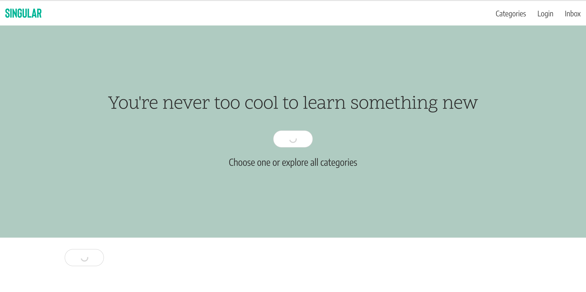

Singular is a platform to explore and connect with peers through the power of learning and teaching.

Singular is open and free to use, it enables a user to curate his profile and offer to teach unique skills to the community of users, all in a simple and friendly interface coupled to a secure login.

### Screenshot

# Getting started

Clone the repo, then in project directory, run the following scripts:

- `npm install`
- `npm start`
- `npm watch-css`

Runs the app in the development mode. [http://localhost:3000](http://localhost:3000) in local machine.

## Singular app expects a REST api, follow these steps to install it!

1. Clone the [Singular-server repo](https://github.com/cristinaguimaraes/singular-server), follow the steps to install and run mysql and get some sample data installed. Then run server on port 3010.

2. In client repo, configure `server_url` in `config/config.js`, to match local machine ip.

3. Run `npm start`

# Tech stack

### Built with
- React, Redux, Webpack and Babel
- Bulma.io scss-framework for all markup
- Facebook Auth for user management and logins
- Webfonts from Google

### dependencies

  "bulma": "^0.7.1",
  "moment": "^2.22.2",
  "node-sass-chokidar": "^1.3.0",
  "react": "^16.4.1",
  "react-dom": "^16.4.1",
  "react-facebook-login": "^4.0.1",
  "react-moment": "^0.7.7",
  "react-redux": "^5.0.7",
  "react-router-dom": "^4.3.1",
  "react-scripts": "1.1.4",
  "redux": "^4.0.0"

# Contributing
Feel free to make a pull request! We use the following Git Flow and branching strategy:

1. Master is for deployment only
2. `git checkout development` is the common branch that pull request are made on. represents the apps latest state
3. `git checkout -b name/feature` to create new branch for the feature you are building or fixing.
4. `git push --set-upstream origin name/feature` to push to your cloned github repo
5. in github create a pull request from new branch to origin/development
